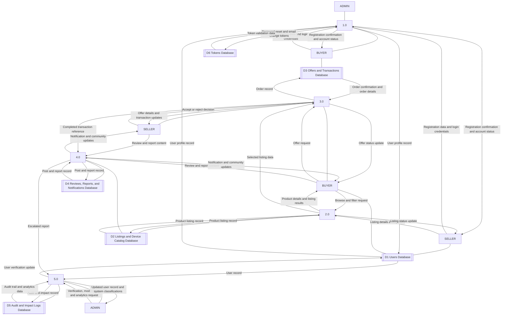
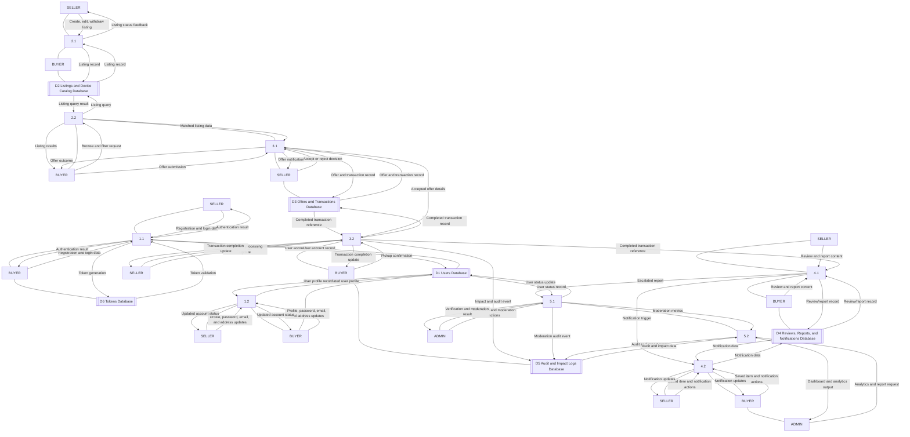

# Use Case Analysis

## Overview

In order to design the E-Benta system according to user needs, the developers employed various tools for data analysis that helped organize, visualize, and interpret information systematically. These tools were essential in understanding system requirements, capturing user interactions, and mapping the workflow of the digital marketplace, ensuring that both functional and nonfunctional needs were addressed before implementation.

## Use Case Diagram

**Figure 3.1: Use Case Diagram**

The developers utilized visual modeling techniques, particularly the use case diagram (Figure 3.1), to illustrate the interactions between system actors such as administrator, seller, and buyer. The diagram highlighted processes like user management, listing handling, offer processing, transaction management, and environmental impact tracking. By mapping each action and dependency, the developers ensured that critical system functionalities were accounted for and logically connected. According to recent research in information systems design, visual modeling techniques like use case diagrams facilitate understanding of complex systems, allowing developers to define functional requirements and workflow dependencies clearly.

In addition, the developers applied these tools to organize and interpret system functionalities and user requirements. The use case diagram enabled the identification of core modules, user roles, and system features that are critical for an efficient e-waste digital marketplace. By mapping out each interaction and process, the developers ensured that all functional requirements, including listing management, offer submission, transaction tracking, and environmental impact certification, were captured and logically connected. These visual analytical tools supported informed design and development decisions by providing a clear representation of system operations, ultimately contributing to the creation of a user-centered platform. Studies on digital marketplace systems demonstrate that incorporating workflow diagrams significantly enhances system planning, reduces errors, and improves usability.

---

# Data Flow Diagrams

To further illustrate how data moves within the E-Benta system, the developers utilized the Data Flow Diagram (DFD) as a key structured modeling tool. The DFD provides a clear and organized representation of how information is processed, transferred, and stored within the system. It focuses on the flow of data between external entities, system processes, and data storage, allowing the developers to better understand how each component interacts during system operation. By using DFD, the developers were able to identify the inputs, processes, and outputs involved in the e-waste digital marketplace, ensuring that all system functionalities are logically connected and efficiently designed.

A Data Flow Diagram is defined as a graphical representation that shows how data flows through a system, including data inputs, processes, storage, and outputs. It simplifies complex system operations into understandable visual elements, making it easier to analyze how information is handled. According to recent research in information systems development, Data Flow Diagrams play an important role as they enhance understanding of how data moves between system processes and users, allowing developers to clearly visualize system interactions and improve overall system design. In the context of E-Benta, the DFD highlights how key users such as the seller, buyer, and administrator interact with the system through processes like registration, listing management, transaction handling, environmental impact tracking, and quality assurance. This allows the developers to ensure that all user actions are properly processed and supported by the system.

## Data Flow Diagram Level 0 (Context Diagram)

**Figure 3.3.1: Data Flow Diagram Level 0**

Figure 3.3.1 shows the Data Flow Diagram Level 0, or context diagram, of the E-Benta system. At this level, E-Benta appears as one central process that exchanges data with three external entities: Seller, Buyer, and Administrator. The seller submits sign up/sign in details (local or Google OAuth), profile updates, listing data, and offer decisions, while the system returns listing status, offer alerts, transaction progress, and impact feedback. The buyer submits sign up/sign in details, browse/filter requests, offers, saved-item actions, and review/report inputs, while the system returns listing details, offer outcomes, notifications, and impact certificates. The administrator submits verification and moderation actions and requests monitoring information, while the system returns pending verifications, user reports, audit logs, and dashboard statistics. This context diagram defines the system boundary and presents E-Benta as a centralized, role-based e-waste marketplace platform.

```mermaid
flowchart LR
	SELLER[Seller]
	BUYER[Buyer]
	ADMIN[Administrator]
	SYSTEM((E-Benta Marketplace System))

	SELLER -->|Register/Login (Local or Google), Profile and Listing Data, Offer Decisions| SYSTEM
	SYSTEM -->|Listing Status, Offer Alerts, Transaction Updates, Impact Feedback| SELLER

	BUYER -->|Register/Login, Browse/Filter Requests, Offers, Saved Items, Reviews/Reports| SYSTEM
	SYSTEM -->|Listing Details, Offer Status, Notifications, Impact Certificate| BUYER

	ADMIN -->|User Verification, Moderation Actions, Report and Audit Requests| SYSTEM
	SYSTEM -->|Pending Verifications, Reports, Audit Logs, Dashboard Statistics| ADMIN
```

---

## Entity Relationship Diagram (ERD)

**Figure 3.4: Entity Relationship Diagram**

The Entity Relationship Diagram (ERD) shows the database structure and relationships between core entities in E-Benta. The system uses a normalized schema aligned with Third Normal Form (3NF) to maintain data integrity and reduce redundancy. Core entities include USERS (seller, buyer, and administrator profiles), LISTINGS (posted electronic devices), OFFERS (buyer bids and methods), DEVICE_TYPES/BRANDS/MODELS (device classification hierarchy), IMPACT_LOGS (sustainability records), REVIEWS (quality and trust feedback), ADDRESSES (user location records), SAVED_ITEMS (wishlist data), NOTIFICATIONS (system alerts), AUDIT_LOGS (administrative monitoring), and REPORTS (user complaints and moderation cases). The diagram maps one-to-many relationships that represent key workflows such as user-to-listing creation, listing-to-offer submissions, transaction-to-impact logging, and user/admin-to-audit activity. This structure enforces referential integrity through foreign keys and supports reporting, analytics, and operational queries.

```mermaid
erDiagram
   
```

---

## Data Flow Diagram Level 1 (Expanded Functional View)

**Figure 3.3.2: Data Flow Diagram Level 1**

Figure 3.3.2 shows the Data Flow Diagram Level 1, which expands E-Benta into five major processes and six data stores. The process groups are 1.0 Account & Profile, 2.0 Listings & Catalog, 3.0 Offers & Transactions, 4.0 Reviews, Reports & Alerts, and 5.0 Admin, Audit & Analytics. These processes exchange data with D1 Users, D2 Listings/Device Catalog, D3 Offers/Transactions, D4 Reviews/Reports/Notifications, D5 Audit/Impact Logs, and D6 Tokens. The diagram shows how user account data, listing data, offer and transaction data, review/report data, and audit/impact data move between actors and internal processes. It captures active flows for registration and authentication, listing management, offer decision and completion, notifications and reports, and administrative verification and monitoring.



Process labels used in Figure 3.3.2: 1.0 Account & Profile, 2.0 Listings & Catalog, 3.0 Offers & Transactions, 4.0 Reviews, Reports & Alerts, 5.0 Admin, Audit & Analytics.

---

## Data Flow Diagram Level 2 (Detailed Sub-Processes)

**Figure 3.3.3: Data Flow Diagram Level 2**

Figure 3.3.3 shows the Data Flow Diagram Level 2, which decomposes each Level 1 process into two focused sub-processes: 1.1 Sign Up & Sign In and 1.2 Profile & Security Settings under 1.0 Account & Profile; 2.1 Manage Listings and 2.2 Search Listings under 2.0 Listings & Catalog; 3.1 Submit & Decide Offers and 3.2 Complete Transactions under 3.0 Offers & Transactions; 4.1 Reviews & Reports and 4.2 Notifications & Saved Items under 4.0 Reviews, Reports & Alerts; and 5.1 Verify & Moderate Users and 5.2 Audit, Impact & Reports under 5.0 Admin, Audit & Analytics. Each sub-process shows how actors submit inputs, how the system validates and processes data, and how outputs return to users while records are stored and retrieved from the corresponding data stores.



Subprocess labels used in Figure 3.3.3: 1.1 Sign Up & Sign In, 1.2 Profile & Security Settings, 2.1 Manage Listings, 2.2 Search Listings, 3.1 Submit & Decide Offers, 3.2 Complete Transactions, 4.1 Reviews & Reports, 4.2 Notifications & Saved Items, 5.1 Verify & Moderate Users, 5.2 Audit, Impact & Reports.

### Detailed Sub-Process Specifications (1.1 to 5.2)

#### 1.1 Sign Up & Sign In
- Purpose: Create and authenticate buyer or seller accounts using local credentials or Google OAuth.
- Primary actors: Buyer, Seller.
- Main routes and controllers: AuthController (register, login, forgot/reset password), GoogleAuthController (redirect, callback, role selection, registration confirmation).
- Inputs: Name, email, password, selected role, OAuth profile data, password reset token and new password.
- Core system actions: Validate credentials and role, create user record, verify uniqueness of email, issue authentication session, issue and validate password reset or registration tokens.
- Data stores: D1 Users Database, D6 Tokens Database.
- Outputs: Registration confirmation, login success or failure message, authenticated session state.

#### 1.2 Profile & Security Settings
- Purpose: Maintain account profile information and account security settings after authentication.
- Primary actors: Buyer, Seller.
- Main routes and controllers: AuthController (profile update, change password, request and verify email change), AddressController (create, update, delete, mark primary, list by type).
- Inputs: Profile edits, password change request, email change request, address details.
- Core system actions: Validate owner permissions, update profile fields, hash updated passwords, create email-change token, verify token and apply new email, maintain one primary address rule.
- Data stores: D1 Users Database, D6 Tokens Database.
- Outputs: Updated profile status, security update confirmations, revised address records.

#### 2.1 Manage Listings
- Purpose: Allow sellers to publish and maintain e-waste listings.
- Primary actors: Seller.
- Main routes and controllers: ListingController (create, store, edit, update, withdraw, seller listings, seller dashboard).
- Inputs: Device details, condition, intended action, seller-defined asking price, estimated weight, listing photos, listing status changes.
- Core system actions: Validate seller role, classify device via type/brand/model, store listing and media references, enforce edit and ownership rules, set listing lifecycle status.
- Data stores: D2 Listings and Device Catalog Database.
- Outputs: Listing creation confirmation, listing update status, withdrawal confirmation.

#### 2.2 Search Listings
- Purpose: Present searchable and filterable listing inventory for buyers.
- Primary actors: Buyer (and public visitors for basic listing view).
- Main routes and controllers: ListingController (index, show), DeviceModelController (models by type), OfferController (search for offers context).
- Inputs: Search terms, filter values (device type, brand, model, status), listing selection request.
- Core system actions: Query listing inventory with filters, fetch related device metadata, return listing summaries and listing detail view.
- Data stores: D2 Listings and Device Catalog Database.
- Outputs: Filtered listing results, selected listing details used by offer creation flow.

#### 3.1 Submit & Decide Offers
- Purpose: Capture buyer offers and seller acceptance or rejection decisions.
- Primary actors: Buyer, Seller.
- Main routes and controllers: OfferController (create, store, show, accept, reject), ListingController (get offers for seller).
- Inputs: Offer amount, proposed pickup method/date, seller decision action.
- Core system actions: Validate listing availability and ownership constraints, save offer record, enforce one active decision path, update offer status, trigger notifications.
- Data stores: D3 Offers and Transactions Database.
- Outputs: Offer submitted status, accepted or rejected decision result, updated offer timeline.

#### 3.2 Complete Transactions
- Purpose: Manage post-acceptance transaction progression until completion.
- Primary actors: Buyer, Seller.
- Main routes and controllers: OfferController (mark picked up, update processing status, buyer/seller transaction history, seller analytics), ImpactController (certificate view).
- Inputs: Pickup confirmation, processing status updates, completion confirmation.
- Core system actions: Move transaction through lifecycle states, record operational milestones, compute impact-trigger events, make completed transactions available for history and certificate retrieval.
- Data stores: D3 Offers and Transactions Database, D5 Audit and Impact Logs Database.
- Outputs: Transaction completion updates, history records, impact certificate availability.

#### 4.1 Reviews & Reports
- Purpose: Collect trust feedback and flag misconduct or quality issues.
- Primary actors: Buyer, Seller.
- Main routes and controllers: ReviewController (create, store, show, destroy, report, user reviews), ReportController (create and store user reports).
- Inputs: Rating, review content, report reason, reported entity reference.
- Core system actions: Validate eligibility to review (transaction-linked), persist reviews, persist incident reports, expose review history and report references for moderation.
- Data stores: D4 Reviews, Reports, and Notifications Database.
- Outputs: Saved review records, submitted report records, moderation-ready report queue.

#### 4.2 Notifications & Saved Items
- Purpose: Deliver user alerts and support listing bookmarking.
- Primary actors: Buyer, Seller.
- Main routes and controllers: NotificationController (list, unread count, recent, mark read, mark all read, delete), SavedItemController (list, save, remove).
- Inputs: Saved-item actions, notification read/unread actions, event-triggered notification payloads.
- Core system actions: Create and update notification status, return recent alerts, maintain saved listing references per user.
- Data stores: D4 Reviews, Reports, and Notifications Database (notifications and saved-item-related records).
- Outputs: Real-time notification updates, saved item list updates, unread counters.

#### 5.1 Verify & Moderate Users
- Purpose: Execute admin-side account verification and moderation workflows.
- Primary actors: Administrator.
- Main routes and controllers: AdminController (pending verifications, verify user, reject user, listing and offer oversight), ReportController (admin report review and action states).
- Inputs: Verification actions, moderation decisions, report resolution actions.
- Core system actions: Review pending users, apply verify/reject decisions, move report states (under review, resolved, dismissed), apply moderation outcomes to user/system records.
- Data stores: D1 Users Database, D2 Listings and Device Catalog Database, D3 Offers and Transactions Database, D4 Reviews, Reports, and Notifications Database, D5 Audit and Impact Logs Database.
- Outputs: Updated verification status, moderation outcome records, escalated actions for audit trail.

#### 5.2 Audit, Impact & Reports
- Purpose: Provide governance visibility, sustainability metrics, and executive reporting.
- Primary actors: Administrator.
- Main routes and controllers: AuditLogController (index, show, user logs, model logs, export, cleanup), AdminController (dashboard, dashboard export, impact logs, generated reports, statistics).
- Inputs: Audit queries, report generation requests, dashboard metric requests.
- Core system actions: Aggregate audit events, retrieve impact data linked to completed transactions, compute and return dashboard statistics, export administrative reports.
- Data stores: D5 Audit and Impact Logs Database (primary), with references to D1 and D3 for contextual aggregation.
- Outputs: Audit trail views, impact summaries, dashboard analytics, exportable reports.

---

The use of multi-level Data Flow Diagrams enabled the developers to systematically analyze and design the flow of information within the E-Benta system. By progressing from a general overview to a more detailed breakdown, the developers ensured that all interactions between users, processes, and data storage are clearly defined and logically structured. This approach not only improved the accuracy of system design but also minimized errors during development and implementation. Furthermore, it enhanced communication among developers by providing a shared visual understanding of system operations. Supported by recent studies in information systems, structured data flow modeling improves system understanding, design clarity, and overall system effectiveness. Therefore, the application of DFD in E-Benta played a crucial role in ensuring a smooth, organized, and effective e-waste marketplace that successfully connects sellers and buyers while promoting environmental sustainability through transparent impact tracking and accountability.